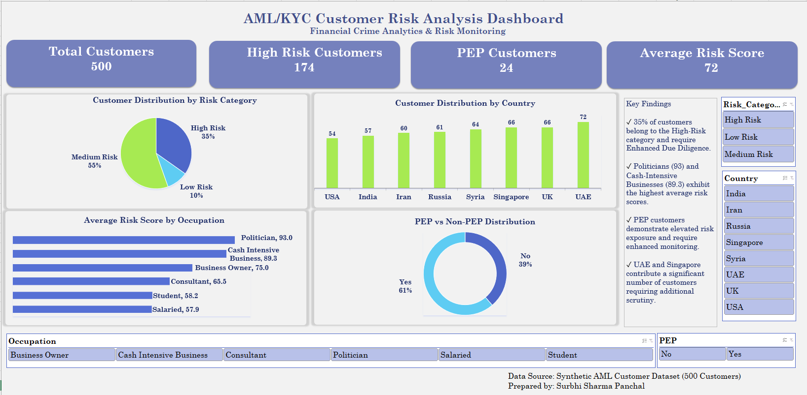

# AML-KYC-Customer-Risk-Analysis

## Project Overview

This project analyzes customer risk profiles and transaction patterns using PostgreSQL and Excel. It focuses on identifying high-risk customers, evaluating geographical and occupational risk exposure, analyzing Politically Exposed Persons (PEPs), and generating actionable insights for AML/KYC compliance. An interactive Excel dashboard complements the SQL analysis with visual risk monitoring and decision-making.

## Dashboard Preview



## Objectives

* Analyze customer risk distribution.
* Identify high-risk customer segments.
* Evaluate country-wise and occupation-wise risk exposure.
* Assess the impact of PEP status on customer risk.
* Detect customers requiring Enhanced Due Diligence (EDD).
* Build an interactive dashboard for risk monitoring.

## Dataset Description

The dataset contains the following attributes:

* Customer_ID
* Age
* Country
* Occupation
* Annual_Income
* Monthly_Transactions
* Avg_Transaction_Value
* PEP Status
* High_Risk_Country
* Risk_Score
* Risk_Category

## Tools Used

* PostgreSQL
* SQL
* Microsoft Excel
* Pivot Tables
* Pivot Charts
* Slicers
* GitHub

## Business Questions

1. How many customers are present in the dataset?
2. How are customers distributed across risk categories?
3. What percentage of customers belong to the High-Risk category?
4. How many customers are Politically Exposed Persons (PEPs)?
5. What is the overall average customer risk score?
6. Which occupations have the highest average risk scores?
7. Which countries have the largest customer base?
8. Which countries contribute the highest number of High-Risk customers?
9. Which countries exhibit the highest average risk scores?
10. Do PEP customers have higher average risk scores than non-PEP customers?
11. How many High-Risk customers are also PEPs?
12. Which occupations contribute the most High-Risk customers?
13. How many customers originate from High-Risk countries?
14. Which customers require Enhanced Due Diligence (EDD)?
15. How are customers distributed across Risk Categories and PEP status?

## SQL Analysis

The analysis includes:

* Risk category analysis
* Country-wise risk assessment
* Occupation-based risk profiling
* PEP vs Non-PEP comparison
* High-risk customer identification
* Cross-analysis between PEP status and risk category
* Aggregation and grouping operations

The complete SQL queries are available in:

📄 **SQL Queries:** [AML_KYC_Analysis.sql](sql_queries/AML_KYC_Analysis.sql)

## Dashboard Features

* Risk Category Distribution
* Country-wise Customer Distribution
* Country-wise Risk Analysis
* Occupation-wise Risk Analysis
* PEP Customer Analysis
* High-Risk Country Analysis
* Risk Score Metrics
* Interactive Filters and Slicers

## Key Findings

* High-risk customers account for **174 out of 500 customers (34.8%)**, indicating a significant concentration of elevated-risk profiles.
* Russia (41), Syria (40), and Iran (36) contribute the highest number of High-Risk customers.
* PEP customers exhibit a substantially higher average risk score (113.86) compared with non-PEP customers (95.10), highlighting increased risk exposure among politically exposed person.
* Politicians (103.4) and Business Owners (100.6) have the highest average risk scores, while Salaried customers have the lowest average risk score (85.0).
* The customer base consists of **174 High-Risk**, **277 Medium-Risk**, and **49 Low-Risk** customers, with Medium-Risk customers forming the largest segment.
* High-risk customers and PEPs require Enhanced Due Diligence (EDD) and closer monitoring.

## Repository Structure

```text
AML-KYC-Customer-Risk-Analysis/
│
├── README.md
├── dataset/
│   └── customers.csv
├── sql_queries/
│   └── aml_kyc_analysis.sql
├── dashboard/
│   └── AML_KYC_Dashboard.xlsx
└── screenshots/
    ├── dashboard.png
    ├── risk_distribution.png
    ├── country_risk_analysis.png
    └── occupation_risk_analysis.png
```

## Skills Demonstrated

* PostgreSQL
* SQL Querying
* Data Aggregation and Filtering
* CASE Statements
* GROUP BY and ORDER BY
* Risk Segmentation
* Data Analysis
* AML/KYC Analytics
* Financial Crime Risk Assessment
* Excel Dashboard Development
* Pivot Tables and Charts
* Data Visualization
* Business Insight Generation

## Conclusion

This project demonstrates how SQL and Excel dashboards can transform customer-level data into meaningful insights for AML/KYC risk assessment. By combining analytical queries with interactive visualizations, the project showcases practical applications of data analytics in financial crime compliance and risk management.


