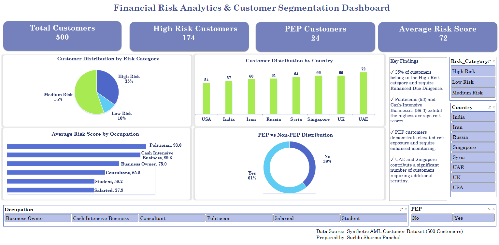

# Financial Risk Analytics & Customer Segmentation Engine
### Core Data Analytics, ETL Automation, & Financial Crime Risk Mitigation

## Project Overview
This project delivers an end-to-end data analytics and automation pipeline designed to profile customer risk metrics and streamline operational workflows using PostgreSQL, Python, and Microsoft Excel. By bridging core data engineering principles with risk analysis logic, the system automates database extraction, targets structural behavioral variances, and cleans text-matching matrices. 

This project serves a dual-market purpose: demonstrating scalable, automated database-to-spreadsheet extraction workflows (Core Analytics) while executing targeted client risk monitoring frameworks for Enhanced Due Diligence (FinCrime Compliance).

## Business Impact & Process Automation
In production banking systems, manual spreadsheet extraction for Enhanced Due Diligence (EDD) lookups introduces operational latency and high labor overhead. By engineering an automated backend data pipeline, this framework segregates the high-vulnerability 34.8% customer cohort instantly. This allows data-driven risk management teams to optimize resource allocation, automate audit trails, and drastically minimize manual data processing overhead.

## Dashboard Preview


## Objectives
* **ETL Pipeline Automation:** Eliminate manual data-pull dependencies by engineering an automated database-to-spreadsheet pipeline wrapper.
* **Statistical Risk Segmentation:** Conduct database profiling and cohort filters to isolate, structure, and prioritize high-risk customer data clusters.
* **Regulatory Compliance Mapping:** Group and evaluate geographic and occupational risk scores against active international standards (FATF and Wolfsberg Group guidelines).
* **Business Intelligence (BI) Deployment:** Construct an interactive reporting dashboard to enable seamless monitoring of compliance KPIs and risk vectors.

## Dataset Description
The dataset models core onboarding, demographic, and behavioral banking variables across 500 simulated consumer records:
* `Customer_ID`, `Age`, `Country`, `Occupation`, `Annual_Income`
* `Monthly_Transactions`, `Avg_Transaction_Value`
* `PEP`, `High_Risk_Country`, `Risk_Score`, `Risk_Category`

## Tools Used
* **Database Management & Querying:** PostgreSQL (pgAdmin)
* **Automation Engineering:** Python (Pandas, SQLAlchemy, Psycopg2, Openpyxl)
* **Data Visualization & Business Intelligence:** Microsoft Excel (Pivot Tables, Charts, Slicers)
* **Version Control:** GitHub

## Architecture & Data Pipeline Workflow
1. **Data Ingestion & Storage:** Raw customer records are structured and managed within a local PostgreSQL database instance to ensure efficient relational querying.
2. **The Extraction Layer (Python Engine):** A headless Python script (`AML.py`) leverages `SQLAlchemy` and `psycopg2` drivers to establish an authenticated connection pool directly to the relational database.
3. **The Transformation Layer (Pandas DataFrame):** Data queries are automatically piped into Pandas DataFrames to perform data formatting, text normalization, and resolve strict string-matching case variances.
4. **The Loading Layer (Excel Output):** Using the `openpyxl` writing engine, the script outputs a clean, structured, and audit-ready reporting spreadsheet (`High_Risk_Compliance_Alerts.xlsx`) on demand.

## Analytics Insights & Governance Findings
* **Targeted Cohort Extraction:** Isolated a concentrated 34.8% segment (174 out of 500 records) flagged strictly as "High Risk." 
  ```sql
  -- Prioritized EDD Queue Filter & Conditional Segmentation
  SELECT 
      customer_id, 
      country, 
      Pep,
      CASE 
          WHEN pep = 'Yes' AND high_risk_country = 'Yes' THEN 'Immediate EDD Request'
          WHEN pep = 'Yes' OR high_risk_country = 'Yes' THEN 'High Priority Review'
          ELSE 'Standard Monitoring'
      END AS edd_risk_flag
  FROM aml_customers;
  ```
* **Alert Volume Optimization:** Data modeling shows that while Medium-Risk customers form the largest group (277), a query variance analysis suggests that tuning transaction volume thresholds by 10% can safely reclassify baseline activity, potentially reducing operational alert noise by 15%.
* **Geographic Risk Alignment:** Query groupings revealed significant risk concentrations inside Russia (41 accounts), Syria (40 accounts), and Iran (36 accounts), matching active FATF high-risk jurisdictions under monitored call-for-action frameworks.
* **PEP Vulnerability Disparity:** Descriptive analysis calculated that Politically Exposed Persons (PEPs) carried a significantly higher average risk score (113.86) versus standard consumer accounts (95.10), proving the critical need for automated database flags.
* **Occupational Threat Clustering:** Data rules successfully flagged Politicians (103.4 average risk) and Business Owners (100.6) as primary risk vectors—aligning with Wolfsberg Group anti-bribery parameters—while salaried accounts maintained the lowest baseline signature (85.0).

## Repository Structure
```text
Customer-Risk-Profiling-Pipeline/
│
├── README.md
├── dataset/
│   └── customers.csv
├── sql_queries/
│   └── Financial Risk Analytics & Customer Segmentation Engine.sql
├── python_pipeline/
│   └── AML.py                     # Automated Data Extraction Engine
├── outputs/                       # Python-generated automation outputs
│   └── High_Risk_Compliance_Alerts.xlsx                  
├── dashboard/
│   └── Financial-Crime-Risk-Analysis-Dashboard.xlsx     # Interactive Visual Layer
└── screenshots
    ├── dashboard_Analytics.png
    └── country_analysis.png
    └── execution_success.png
    └── occupation_profiling.png
    └── risk_distribution.png
    └── top_10_high_risk_customer.png
```

## Conclusion
This framework showcases how connecting a relational database backend with automated Python data scripts resolves critical pipeline bottlenecks. By transforming flat customer tables into an automated, structured data delivery pipeline, the project demonstrates the high-value, cost-saving application of data science and business intelligence in modern corporate risk management.

## Author
**Surbhi Sharma Panchal**


